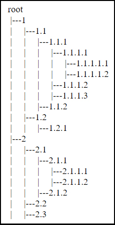
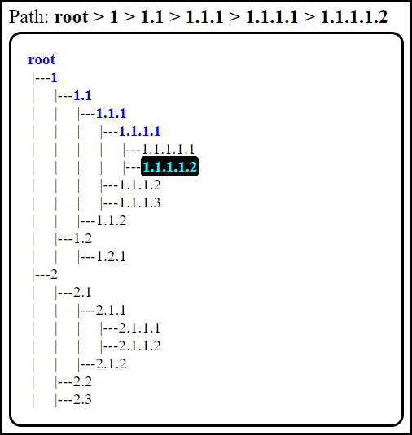

# Create and Display a Tree Structure with an Arbitrary Number of Nodes

When I have a tree structure, I like to see the structure, graphically.

There is NO NEED to have a well-centered tree like we could often see in the books. But we could show the tree like:

This program is using: **jQuery**, **JavaScript**, **HTML** and **CSS**. The structure (position of nodes) is built randomly, we could choose the number of nodes.

You could choose an active node, by clicking on it and the path to that node will be showed:

This way of displaying could be useful for data structure of a tree form...